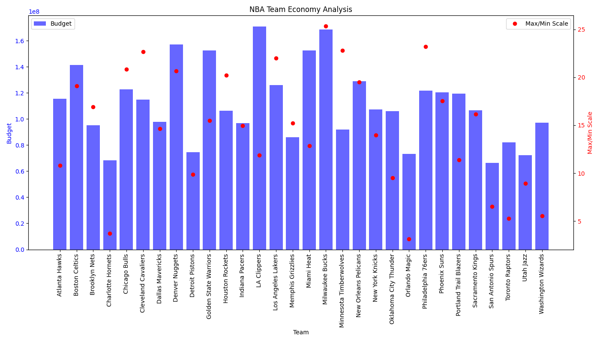

# NBA Stats

Web scrapping tool to retrieve information from the [ESPN webpage](https://www.espn.com/nba/salaries) and perform some analysis.

# Files
Tool composed of two scrits
 - `WebScrap_NBA.py`: Retrieves all the information from [ESPN/nba/salaries](https://www.espn.com/nba/salaries) and saves it into `nba_player_salaries.csv`. 
 - `Stats_NBA.py`:  Reads  `nba_player_salaries.csv`  and performs data analysis. It has the following functions: 
	 - `plot_histogram`: Shows the distribution of salaries and fits the histogram.
	 - `get_average_by_pos`: Calculates the average salary by position.
	 - `TeamStarters`: Selects a single player per position for each team.
	 - `TeamBudget`: Creates plots showing each team's budget and salary differences.

# Packages
Required  packages:

> pip install beautifulsoup4 requests  # Web Scraping  
> pip install pandas scipy matplotlib    # Stats